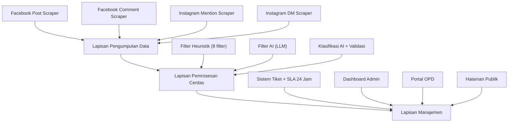
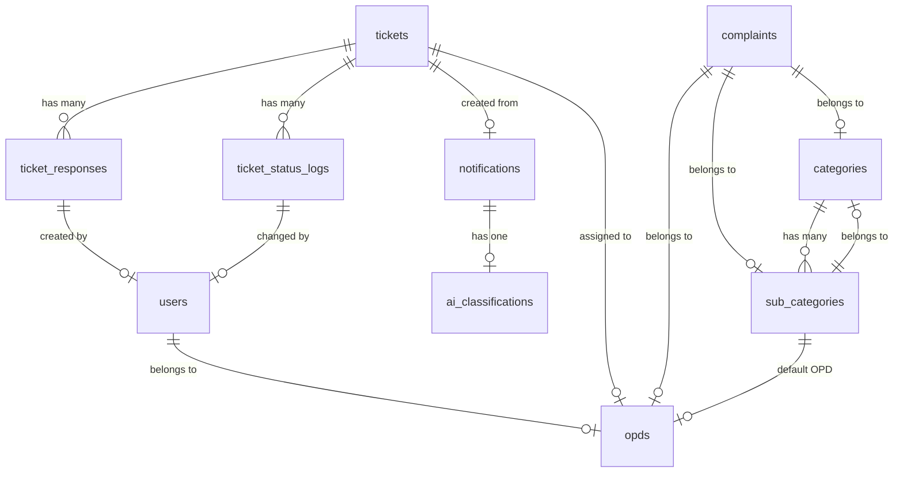
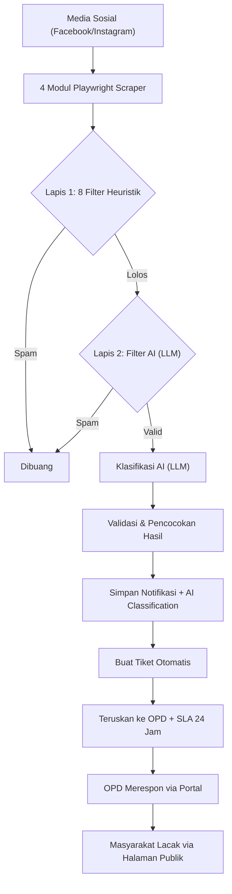
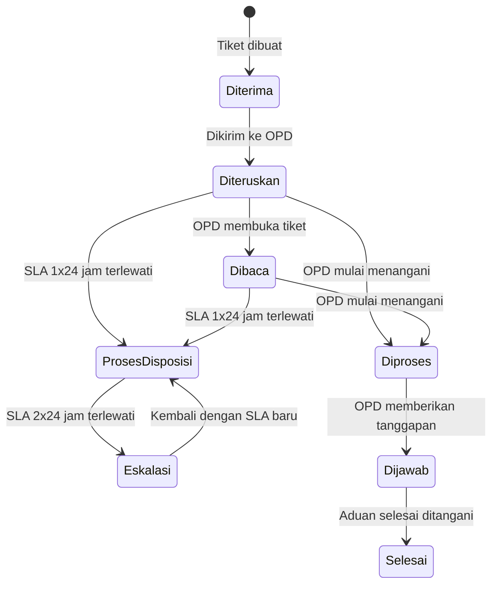

# 📋 Analisis Lengkap Project SIMADU-KMC untuk Laporan Tugas Akhir

> [!NOTE]
> Dokumen ini berisi seluruh informasi yang diekstrak dari codebase project SIMADU-KMC untuk keperluan penyusunan Laporan Tugas Akhir.

---

## 1. INFORMASI UMUM PROJECT

| Aspek | Detail |
|-------|--------|
| **Nama Aplikasi** | SIMADU-KMC (Sistem Manajemen Pengaduan Ketapang Media Center) |
| **Judul Penelitian** | Pengembangan Aplikasi Notifikasi Aduan Multi-Channel Berbantuan AI untuk Klasifikasi, Deteksi Duplikasi, dan Prioritas Eskalasi pada Ketapang Media Center |
| **Penulis** | Achmad Bagus Aprianto¹, Rizqia Lestika Atimi², Darmanto³ |
| **Institusi** | Jurusan Teknik Informatika, Politeknik Negeri Ketapang |
| **Alamat** | Jl. Rangga Sentap, Dalong, Kec. Delta Pawan, Kab. Ketapang, Kalimantan Barat 78813 |
| **Email** | bagusaprianto@gmail.com |
| **Metode Pengembangan** | Waterfall (Analisis → Perancangan → Implementasi → Pengujian) |

---

## 2. TEKNOLOGI YANG DIGUNAKAN (TECHNOLOGY STACK)

### 2.1 Backend
| Komponen | Teknologi | Versi | Keterangan |
|----------|-----------|-------|------------|
| Framework | Laravel | 13.8 (Laravel 12+) | Framework PHP dengan arsitektur MVC |
| Bahasa | PHP | ^8.3 | Runtime backend |
| Database | MySQL | - | Database utama (`kmc`) |
| Database (Alt) | SQLite | - | Database alternatif (file `database.sqlite`) |
| Queue | Database | - | Antrian pekerjaan menggunakan tabel database |
| Session | Database | - | Sesi pengguna disimpan di database |
| Cache | Database | - | Cache menggunakan database |
| Timezone | Asia/Jakarta | - | Zona waktu Indonesia |
| Locale | id (Indonesia) | - | Bahasa default Indonesia |

### 2.2 Frontend
| Komponen | Teknologi | Versi | Keterangan |
|----------|-----------|-------|------------|
| Template Engine | Blade Template | - | Bawaan Laravel |
| CSS Framework | TailwindCSS | ^4.0.0 | Utility-first CSS |
| Build Tool | Vite | ^8.0.0 | Frontend bundler |
| Plugin Vite | laravel-vite-plugin | ^3.1 | Integrasi Laravel + Vite |
| Plugin Tailwind | @tailwindcss/vite | ^4.0.0 | Plugin Tailwind untuk Vite |
| Visualisasi | Chart.js | - | Grafik interaktif di dashboard |
| Concurrency | concurrently | ^9.0.1 | Menjalankan server+queue+vite bersamaan |

### 2.3 AI / Machine Learning
| Komponen | Teknologi | Keterangan |
|----------|-----------|------------|
| AI Model | Gemma 4 31B IT | Model LLM dari Google via Gemini API |
| AI API | Gemini API | API untuk klasifikasi teks (generative AI) |
| AI Package | openai-php/laravel ^0.19.1 | Library PHP untuk integrasi OpenAI-compatible API |
| AI Provider (Alternatif) | OpenRouter, Groq | Provider AI lain (komentar di .env) |

### 2.4 Web Scraping
| Komponen | Teknologi | Keterangan |
|----------|-----------|------------|
| Engine | Playwright (Node.js) | Otomatisasi browser Chromium |
| Runtime | Node.js v22.9.0 | Runtime untuk script Playwright |
| Platform Target | Facebook, Instagram | Sumber data aduan |

### 2.5 Library Tambahan
| Library | Versi | Fungsi |
|---------|-------|--------|
| google/apiclient | ^2.15 | Google Sheets API (opsional) |
| phpoffice/phpword | ^1.4 | Generasi dokumen Word (.docx) |
| fakerphp/faker | ^1.23 | Data dummy untuk testing |
| phpunit/phpunit | ^12.5 | Unit testing |

---

## 3. ARSITEKTUR SISTEM

### 3.1 Tiga Lapisan Utama



### 3.2 Struktur Direktori Aplikasi

```
SIMADU-KMC/
├── app/
│   ├── Console/Commands/         # 8 Artisan commands
│   │   ├── CheckEscalation.php       # Cek SLA & auto eskalasi
│   │   ├── SyncFacebookPostMentions.php   # Sync FB post
│   │   ├── SyncFacebookCommentMentions.php # Sync FB komentar
│   │   ├── SyncInstagramMentions.php      # Sync Instagram DM
│   │   ├── TestAI.php                     # Testing AI
│   │   ├── MakeDummyNotifications.php     # Dummy data
│   │   ├── MakeDummyOpdNotifications.php  # Dummy data OPD
│   │   └── SyncFacebookMentions.php       # Sync FB mention (legacy)
│   ├── Http/
│   │   ├── Controllers/
│   │   │   ├── Admin/
│   │   │   │   ├── AdminOpdController.php     # CRUD OPD
│   │   │   │   └── AdminProfileController.php  # Profil admin
│   │   │   ├── Auth/
│   │   │   │   └── AuthController.php          # Login/Logout
│   │   │   ├── Opd/
│   │   │   │   └── OpdController.php           # Portal OPD
│   │   │   ├── Public/
│   │   │   │   └── TicketingController.php     # Halaman publik
│   │   │   ├── ComplaintController.php          # Simpan aduan
│   │   │   ├── DashboardController.php          # Dashboard admin
│   │   │   ├── FacebookMentionController.php    # Sync FB via API
│   │   │   ├── NotificationController.php       # Kelola notifikasi
│   │   │   └── TicketController.php             # CRUD tiket
│   │   └── Middleware/
│   │       └── RoleMiddleware.php               # Role-based access
│   ├── Models/                   # 15 Model Eloquent
│   │   ├── AIClassification.php
│   │   ├── Category.php
│   │   ├── Complaint.php
│   │   ├── FacebookCommentMention.php
│   │   ├── FacebookMention.php
│   │   ├── FacebookPostMention.php
│   │   ├── InstagramMention.php
│   │   ├── Message.php
│   │   ├── Notification.php
│   │   ├── Opd.php
│   │   ├── SubCategory.php
│   │   ├── Ticket.php
│   │   ├── TicketResponse.php
│   │   ├── TicketStatusLog.php
│   │   └── User.php
│   ├── Providers/
│   └── Services/                 # 4 Service Classes
│       ├── AIClassificationService.php  # 1343 baris! (inti AI)
│       ├── InstagramService.php
│       ├── TicketingService.php
│       └── WhatsAppService.php
├── database/
│   ├── migrations/               # 28 migration files
│   ├── seeders/                  # 5 seeder files
│   └── factories/
├── resources/views/              # Blade templates
│   ├── admin/                    # Admin views (OPD mgmt, profil)
│   ├── auth/                     # Login page
│   ├── layouts/                  # Layout templates
│   ├── notifications/            # Notifikasi views
│   ├── opd/                      # OPD portal views
│   ├── partials/                 # Partial components
│   ├── public/                   # Halaman publik
│   ├── tickets/                  # Tiket admin views
│   ├── dashboard.blade.php       # Dashboard admin (30KB)
│   └── notifications.blade.php   # Halaman notifikasi
├── playwright/                   # 33 files (scraper scripts)
│   ├── facebook-post-final.js       # 13KB - FB post scraper
│   ├── facebook-comment-final.js    # 18KB - FB comment scraper
│   ├── instagram-dm.js              # 12KB - IG DM scraper
│   ├── instagram-final.js           # 11KB - IG mention scraper
│   ├── facebook-session.json        # Sesi FB tersimpan
│   └── ... (debug files, test scripts)
├── routes/
│   ├── web.php                   # 505 baris route definitions
│   └── console.php               # Scheduled tasks
└── generate_docx.php             # Generator dokumen jurnal
```

---

## 4. PERANCANGAN DATABASE (Entity Relationship)

### 4.1 Diagram Relasi



### 4.2 Detail Tabel Database

#### Tabel `users`
| Kolom | Tipe | Keterangan |
|-------|------|------------|
| id | BIGINT (PK) | Primary key |
| name | VARCHAR | Nama pengguna |
| username | VARCHAR (UNIQUE) | Username login |
| email | VARCHAR (UNIQUE) | Email login |
| role | ENUM('admin', 'opd') | Role pengguna |
| opd_id | FK → opds | OPD terkait (nullable) |
| profile_photo | VARCHAR | Path foto profil |
| password | VARCHAR | Password (hashed) |
| email_verified_at | TIMESTAMP | Waktu verifikasi email |
| remember_token | VARCHAR | Token remember me |
| created_at, updated_at | TIMESTAMP | Timestamps |

#### Tabel `opds`
| Kolom | Tipe | Keterangan |
|-------|------|------------|
| id | BIGINT (PK) | Primary key |
| name | VARCHAR | Nama OPD |
| created_at, updated_at | TIMESTAMP | Timestamps |

#### Tabel `categories`
| Kolom | Tipe | Keterangan |
|-------|------|------------|
| id | BIGINT (PK) | Primary key |
| name | VARCHAR | Nama kategori |
| created_at, updated_at | TIMESTAMP | Timestamps |

#### Tabel `sub_categories`
| Kolom | Tipe | Keterangan |
|-------|------|------------|
| id | BIGINT (PK) | Primary key |
| category_id | FK → categories | Kategori induk |
| opd_id | FK → opds | OPD default |
| name | VARCHAR | Nama sub-kategori |
| created_at, updated_at | TIMESTAMP | Timestamps |

#### Tabel `notifications`
| Kolom | Tipe | Keterangan |
|-------|------|------------|
| id | BIGINT (PK) | Primary key |
| title | VARCHAR | Judul notifikasi (Facebook Mention, Instagram DM, dll) |
| sender | VARCHAR | Nama pengirim |
| message | TEXT | Isi pesan/aduan |
| permalink | VARCHAR (UNIQUE) | Link ke postingan asli |
| comment_message | TEXT | Isi komentar (untuk FB Comment) |
| is_read | BOOLEAN | Status sudah dibaca |
| created_at, updated_at | TIMESTAMP | Timestamps |

#### Tabel `ai_classifications`
| Kolom | Tipe | Keterangan |
|-------|------|------------|
| id | BIGINT (PK) | Primary key |
| notification_id | FK → notifications | Notifikasi terkait |
| suggested_category | VARCHAR | Kategori yang disarankan AI |
| suggested_sub_category | VARCHAR | Sub-kategori yang disarankan AI |
| suggested_opds | JSON | Daftar OPD yang disarankan AI |
| priority | ENUM('Rendah','Sedang','Tinggi') | Tingkat prioritas |
| confidence | DECIMAL(5,2) | Skor kepercayaan (0-100) |
| reasoning | TEXT | Alasan klasifikasi |
| created_at, updated_at | TIMESTAMP | Timestamps |

#### Tabel `tickets` (Tabel Utama)
| Kolom | Tipe | Keterangan |
|-------|------|------------|
| id | BIGINT (PK) | Primary key |
| notification_id | FK → notifications | Notifikasi asal (nullable) |
| ticket_number | VARCHAR (UNIQUE) | Nomor tiket |
| tracking_number | VARCHAR (UNIQUE) | Nomor resi (KMC-YYYYMMDD-XXXX) |
| ticket_time | DATETIME | Waktu pembuatan tiket |
| platform | VARCHAR | Platform asal (Facebook/Instagram/Web) |
| reporter_name | VARCHAR | Nama pelapor |
| reporter_link | VARCHAR | Link profil pelapor |
| category | VARCHAR | Kategori aduan |
| sub_category | VARCHAR | Sub-kategori aduan |
| opd_related | VARCHAR | Nama OPD terkait |
| complaint | TEXT | Isi keluhan |
| status | ENUM | Status tiket (7 nilai) |
| assigned_opd_id | FK → opds | OPD yang ditugaskan |
| priority | ENUM('rendah','sedang','tinggi') | Prioritas tiket |
| sla_deadline | DATETIME | Batas waktu SLA |
| escalated_at | DATETIME | Waktu terakhir eskalasi |
| escalation_count | INT (default 0) | Jumlah eskalasi |
| read_at | DATETIME | Waktu dibaca OPD |
| responded_at | DATETIME | Waktu direspon OPD |
| ai_confidence | DECIMAL(5,2) | Skor kepercayaan AI |
| ai_reasoning | TEXT | Alasan klasifikasi AI |
| created_at, updated_at | TIMESTAMP | Timestamps |

**Status Tiket (7 nilai):**
`diterima` → `diteruskan` → `dibaca` → `diproses` → `dijawab` → `selesai` | `eskalasi`

#### Tabel `ticket_responses`
| Kolom | Tipe | Keterangan |
|-------|------|------------|
| id | BIGINT (PK) | Primary key |
| ticket_id | FK → tickets | Tiket terkait |
| user_id | FK → users | User yang merespon |
| message | TEXT | Isi tanggapan |
| attachment | VARCHAR | Path lampiran foto |
| created_at, updated_at | TIMESTAMP | Timestamps |

#### Tabel `ticket_status_logs`
| Kolom | Tipe | Keterangan |
|-------|------|------------|
| id | BIGINT (PK) | Primary key |
| ticket_id | FK → tickets | Tiket terkait |
| from_status | VARCHAR (nullable) | Status sebelumnya |
| to_status | VARCHAR | Status baru |
| changed_by | FK → users (nullable) | User yang mengubah (null = sistem) |
| note | TEXT | Catatan perubahan |
| attachment | VARCHAR | Lampiran bukti |
| created_at | TIMESTAMP | Waktu perubahan |

#### Tabel `facebook_post_mentions`
| Kolom | Tipe | Keterangan |
|-------|------|------------|
| id | BIGINT (PK) | Primary key |
| post_link | VARCHAR | Link postingan |
| notification_text | TEXT | Teks notifikasi |
| post_message | TEXT | Isi postingan |
| sender | VARCHAR | Nama pengirim |
| is_read | BOOLEAN | Status dibaca |

#### Tabel `facebook_comment_mentions`
| Kolom | Tipe | Keterangan |
|-------|------|------------|
| id | BIGINT (PK) | Primary key |
| notification_text | TEXT | Teks notifikasi |
| comment_message | TEXT | Isi komentar |
| comment_link | VARCHAR | Link komentar |
| comment_id | VARCHAR | ID komentar |
| is_read | BOOLEAN | Status dibaca |

#### Tabel `instagram_mentions`
| Kolom | Tipe | Keterangan |
|-------|------|------------|
| id | BIGINT (PK) | Primary key |
| post_link | VARCHAR | Link postingan/DM |
| notification_text | TEXT | Teks notifikasi |
| post_message | TEXT | Isi pesan |
| sender | VARCHAR | Nama pengirim |
| message_type | VARCHAR | Tipe pesan (dm/mention) |
| is_read | BOOLEAN | Status dibaca |

---

## 5. ALUR KERJA SISTEM (WORKFLOW)

### 5.1 Alur Pengumpulan & Pemrosesan Aduan



### 5.2 Siklus Hidup Tiket



### 5.3 Mekanisme SLA & Eskalasi

| Tahap | Kondisi | Aksi |
|-------|---------|------|
| **Auto Disposisi** | Tiket status `diteruskan`/`dibaca` melewati SLA 1×24 jam | Status → `proses_disposisi`, SLA reset 24 jam |
| **Eskalasi** | Tiket status `proses_disposisi` melewati SLA 1×24 jam lagi | Prioritas naik (rendah→sedang→tinggi), escalation_count +1, status → `eskalasi` → `proses_disposisi` dengan SLA baru |
| **Pengecekan** | Scheduler `ticket:check-escalation` | Berjalan setiap 30 menit |

---

## 6. FITUR-FITUR UTAMA

### 6.1 Modul Pengumpulan Data (4 Scraper)

| No | Modul | Command | Jadwal | File Playwright |
|----|-------|---------|--------|-----------------|
| 1 | Facebook Post Scraper | `facebook:post-sync` | Setiap menit | `facebook-post-final.js` (13KB) |
| 2 | Facebook Comment Scraper | `facebook:comment-sync` | Setiap menit | `facebook-comment-final.js` (18KB) |
| 3 | Instagram DM Scraper | `instagram:sync-dm` | Setiap 5 menit | `instagram-dm.js` (12KB) |
| 4 | Instagram Mention Scraper | (manual) | - | `instagram-final.js` (11KB) |

### 6.2 Modul Penyaringan Spam (2 Lapis)

**Lapis 1 — 8 Filter Heuristik (tanpa internet):**
1. Pesan kosong
2. Teks terlalu pendek (<8 huruf/angka)
3. Hanya emoji
4. Kata reaksi ("amin", "wkwk", "mantap") dalam pesan <5 kata
5. Hanya angka/simbol
6. Konten non-aduan (ucapan ulang tahun, promosi, giveaway)
7. Hanya @mention tanpa isi bermakna
8. Pesan percobaan ("tes", "test", "halo min")

**Lapis 2 — Filter AI (LLM):**
- Analisis konteks menggunakan model AI
- Memahami dialek Melayu Ketapang
- Fallback: jika API gagal → pesan tetap diproses

### 6.3 Modul Klasifikasi AI

**Proses 4 Tahap:**
1. **Persiapan Teks** — Normalisasi (lowercase, hapus spasi berlebih)
2. **Klasifikasi AI** — Kirim ke Gemini API dengan temperature: 0
3. **Validasi & Retry** — Cek 4 komponen wajib, retry jika invalid
4. **Pencocokan & Perbaikan** — Fuzzy matching 70-90%, resolusi kategori/OPD dari database

**Prompt AI berisi:**
- 28 istilah dialek Melayu Ketapang
- 15 contoh klasifikasi nyata
- Daftar lengkap kategori, sub-kategori, dan OPD
- Aturan prioritas dan format output JSON

**68 Sub-Kategori yang didukung**, termasuk:
- Air Bersih, Lampu Jalan, Jembatan, Jalan, Drainase, Sampah, Banjir, Kebakaran
- KTP, KK, Akta Kelahiran, Bantuan Sosial, KDRT, ODGJ
- Internet, Listrik, Pajak, UMKM, Perikanan, dll.

### 6.4 Kategori Utama (28 Kategori)

| No | Kategori | Contoh Sub-Kategori |
|----|----------|---------------------|
| 1 | Infrastruktur dan Pekerjaan Umum | Jalan, Jembatan, Lampu Jalan, Drainase |
| 2 | Layanan PDAM | Air Bersih |
| 3 | Layanan PLN | Listrik |
| 4 | Sosial dan Kesejahteraan Masyarakat | Bantuan Sosial, KDRT, ODGJ |
| 5 | Lingkungan Hidup dan Kehutanan | Sampah, Pencemaran |
| 6 | Bencana dan Penanggulangan Darurat | Banjir, Kebakaran, Longsor |
| 7 | Administrasi Kependudukan | KTP, KK, Akta |
| 8 | Kesehatan | Puskesmas, BPJS, Rumah Sakit |
| 9 | Pendidikan | Sekolah, Guru |
| 10 | Komunikasi dan Informatika | Internet, Blank Spot |
| 11 | Perizinan dan Investasi | Perizinan Usaha |
| 12 | Keuangan dan Pajak Daerah | Pajak, Retribusi |
| 13 | Pertanian, Perikanan, dan Peternakan | Irigasi, Nelayan |
| 14 | Perdagangan, UMKM, dan Koperasi | UMKM, Pasar |
| 15 | Ketentraman dan Ketertiban Umum | Keamanan, Hewan Liar |
| ... | + 13 kategori lainnya | ... |

### 6.5 OPD Terdaftar (32 OPD)

Termasuk: Dinas PUPR, Dinas Perhubungan, Dinas Sosial, Dinas Kesehatan, BPBD, Disdukcapil, Dinas Pendidikan, PDAM Ketapang, PLN, Satpol PP, RSUD Agoesdjam, Dinas Komunikasi dan Informatika, BPKAD, BPN, Bank Kalbar, Polres Ketapang, dan lainnya.

---

## 7. MANAJEMEN PENGGUNA & KEAMANAN

### 7.1 Role-Based Access Control

| Role | Akses | Dashboard |
|------|-------|-----------|
| **Admin** | Full access: Dashboard, Notifikasi, Tiket (CRUD), Kelola OPD, Kelola User, Profil | `/dashboard` |
| **OPD** | Hanya tiket milik OPD-nya: Dashboard OPD, Daftar Tiket, Respon Tiket, Update Status, Profil | `/opd` |
| **Publik** | Tanpa login: Lacak tiket, Dashboard transparansi | `/ticketing` |

### 7.2 Fitur Keamanan
- **CSRF Protection** pada seluruh formulir
- **Rate Limiting**: 5 request/menit pada endpoint complaint publik
- **Password Hashing**: Bcrypt dengan 12 rounds
- **Login**: Mendukung email DAN username
- **Role Middleware**: `RoleMiddleware` dengan support multi-role (`admin|opd`)
- **OPD Isolation**: Setiap OPD hanya bisa akses tiket miliknya sendiri

### 7.3 Akun Default (dari Seeder)
- **Admin**: `admin@kmc.go.id` / password: `000000`
- **OPD**: Auto-generated berdasarkan nama OPD (slug), password: `000000`

---

## 8. ROUTE / ENDPOINT APLIKASI

### 8.1 Route Publik (tanpa login)

| Method | URI | Controller | Fungsi |
|--------|-----|------------|--------|
| GET | `/` | - | Redirect ke `/ticketing` |
| GET | `/ticketing` | TicketingController@index | Dashboard publik + lacak tiket |
| GET | `/ticketing/{tracking_number}` | TicketingController@show | Detail tiket publik |
| GET | `/login` | AuthController@showLogin | Halaman login |
| POST | `/login` | AuthController@login | Proses login |
| POST | `/complaint` | ComplaintController@store | Kirim aduan (throttle: 5/min) |

### 8.2 Route Admin (role: admin)

| Method | URI | Controller | Fungsi |
|--------|-----|------------|--------|
| GET | `/dashboard` | DashboardController@index | Dashboard admin |
| GET | `/notifications` | NotificationController@index | Daftar notifikasi |
| GET/POST | `/admin/profile` | AdminProfileController | Profil admin |
| CRUD | `/admin/opd` | AdminOpdController | Kelola data OPD |
| CRUD | `/tickets` | TicketController | Kelola tiket (index, create, store, show, edit, update, destroy) |

### 8.3 Route OPD (role: opd)

| Method | URI | Controller | Fungsi |
|--------|-----|------------|--------|
| GET | `/opd` | OpdController@dashboard | Dashboard OPD |
| GET | `/opd/tickets` | OpdController@tickets | Daftar tiket OPD |
| GET | `/opd/tickets/{ticket}` | OpdController@showTicket | Detail tiket |
| POST | `/opd/tickets/{ticket}/respond` | OpdController@respond | Kirim tanggapan |
| POST | `/opd/tickets/{ticket}/status` | OpdController@updateStatus | Update status tiket |
| GET/POST | `/opd/profile` | OpdController@profile | Profil OPD |

### 8.4 Route AJAX (admin|opd)

| Method | URI | Fungsi |
|--------|-----|--------|
| GET | `/notifications-data` | Data notifikasi real-time (JSON) |
| GET | `/notification-summary` | Ringkasan notifikasi (unread/total/read/today) |
| GET | `/notification-count` | Jumlah notifikasi belum dibaca |

---

## 9. SCHEDULED TASKS (Penjadwalan)

| Command | Jadwal | Fungsi |
|---------|--------|--------|
| `facebook:comment-sync` | Setiap 1 menit | Sync komentar Facebook |
| `facebook:post-sync` | Setiap 1 menit | Sync postingan Facebook |
| `instagram:sync-dm` | Setiap 5 menit | Sync DM Instagram |
| `ticket:check-escalation` | Setiap 30 menit | Cek SLA & auto eskalasi |

---

## 10. VIEW / ANTARMUKA PENGGUNA

### 10.1 Halaman Admin

| View | File Size | Fungsi |
|------|-----------|--------|
| `dashboard.blade.php` | 30.9 KB | Dashboard dengan statistik, grafik tren, distribusi platform |
| `notifications.blade.php` | 9.2 KB | Daftar notifikasi dengan search/filter |
| `tickets/index.blade.php` | 15.9 KB | Daftar tiket dengan search/filter/pagination |
| `tickets/create.blade.php` | 20.7 KB | Form buat tiket (dengan pre-fill dari notifikasi + AI) |
| `tickets/show.blade.php` | 13.8 KB | Detail tiket, riwayat status, tanggapan |
| `tickets/edit.blade.php` | 7.5 KB | Edit tiket (kategori, OPD, prioritas) |
| `admin/opd/index.blade.php` | - | Daftar OPD |
| `admin/opd/create.blade.php` | - | Tambah OPD + akun |
| `admin/opd/edit.blade.php` | - | Edit OPD + akun |
| `admin/profile.blade.php` | 6.1 KB | Profil admin |

### 10.2 Halaman OPD

| View | Fungsi |
|------|--------|
| `opd/dashboard.blade.php` (11.8 KB) | Dashboard OPD (statistik tiket, tiket terbaru) |
| `opd/tickets/index.blade.php` | Daftar tiket yang ditugaskan |
| `opd/tickets/show.blade.php` | Detail tiket |
| `opd/tickets/edit.blade.php` | Edit tiket + respon + ubah status |
| `opd/profile.blade.php` (6.2 KB) | Profil OPD |

### 10.3 Halaman Publik

| View | File Size | Fungsi |
|------|-----------|--------|
| `public/ticketing.blade.php` | 35.8 KB | Dashboard transparansi + tabel tiket + cari resi |
| `public/ticketing-detail.blade.php` | 17.0 KB | Detail tiket + progress stepper + riwayat + tanggapan OPD |

---

## 11. KOMPONEN AI CLASSIFICATION SERVICE (1343 baris)

### 11.1 Fitur Utama
- **SUB_CATEGORY_MAP**: 68 mapping sub-kategori → (kategori, OPD) sebagai source of truth
- **classify()**: Metode utama klasifikasi aduan
- **isSpam()**: Filter spam 2 lapis
- **isMonitoringBerita()**: Deteksi link berita lokal (12 domain berita Kalbar)
- **buildPrompt()**: Prompt engineering dengan 15 contoh nyata + 28 dialek lokal
- **callGemini()**: Panggil Gemini API dengan retry 3x dan rate limit handling
- **parseResult()**: Parse JSON dari respons AI
- **isValidResult()**: Validasi 4 komponen wajib
- **sanitizeResult()**: Perbaikan & pencocokan hasil AI
- **resolveSubCategory()**: Fuzzy matching sub-kategori (70-90% similarity)
- **resolveFromSubCategory()**: Auto-resolve kategori & OPD dari database + mapping statis
- **sanitizePriority()**: Validasi prioritas dengan 33 kata kunci tinggi + 26 kata kunci sedang
- **fallbackResultFromMessage()**: Klasifikasi berbasis keyword jika AI gagal

### 11.2 Dialek Melayu Ketapang (28 istilah)

| Dialek | Arti Standar | Contoh Konteks |
|--------|-------------|----------------|
| dak, ndak, sik, sik ada | tidak / tidak ada | "Air dak ngalir" |
| aek, aik | air | "Aik teh" = air keruh |
| parit | drainase / selokan | "Parit tepampat" = selokan tersumbat |
| sumbat, tepampat | tersumbat | - |
| PJU | Penerangan Jalan Umum | "PJU mati" |
| solar sell/cell | lampu jalan tenaga surya | - |
| sanyo | mesin pompa air | - |
| biak | anak-anak / remaja | - |
| bederai, ancur, bapok | rusak parah / hancur | "Jalan bederai" |
| betabur | berserakan | "Sampah betabur" |
| lepak | nongkrong | Terkait ketertiban umum |
| sidak | mereka | - |
| kamek | saya / kami | - |
| kitak | kalian | - |
| pokok | pohon | "Pokok tumbang" |
| ngadang | menghalangi / melintang | - |
| ade | ada | - |
| saye | saya | - |
| dri | dari | - |

---

## 12. PENGUJIAN (BLACK BOX TESTING)

| No | Modul | Skenario | Hasil |
|----|-------|----------|-------|
| 1 | Facebook Post Scraper | Pengambilan postingan mention KMC | ✅ Berhasil |
| 2 | Facebook Comment Scraper | Pengambilan komentar mention tanpa duplikat | ✅ Berhasil |
| 3 | Instagram Mention Scraper | Pengambilan mention dan tag Instagram | ✅ Berhasil |
| 4 | Instagram DM Scraper | Terima otomatis pesan masuk + ambil isi DM | ✅ Berhasil |
| 5 | Filter Heuristik | Saring spam (emoji, teks pendek, kata tes) | ✅ Berhasil |
| 6 | Filter AI | Validasi konteks aduan menggunakan LLM | ✅ Berhasil |
| 7 | Klasifikasi AI | Tentukan kategori, sub-kategori, OPD, prioritas | ✅ Berhasil |
| 8 | Dialek Lokal | Klasifikasi teks berdialek Melayu Ketapang | ✅ Berhasil |
| 9 | Pembuatan Tiket | Buat nomor resi dan teruskan otomatis ke OPD | ✅ Berhasil |
| 10 | SLA 24 Jam | Penetapan dan pemantauan batas waktu | ✅ Berhasil |
| 11 | Portal OPD | Respon tiket disertai lampiran foto | ✅ Berhasil |
| 12 | Pelacakan Publik | Pencarian tiket dan tampilan tahapan | ✅ Berhasil |
| 13 | Hak Akses | Pembatasan akses Admin vs. OPD | ✅ Berhasil |

---

## 13. DAFTAR PUSTAKA (dari generate_docx.php)

1. A. Hermawan dan S. Mulyani, "Artificial Intelligence-Based Classification of Public Complaints..." ESENSI: Jurnal Manajemen Bisnis, vol. 27, no. 1, 2024.
2. R. Pratama dan D. Setiawan, "Implementasi Ensemble Naïve Bayes untuk Klasifikasi Pengaduan Masyarakat..." JTIK, vol. 10, no. 3, 2023.
3. M. Hidayat, et al., "Implementation of a Web Based Automatic Public Complaint Classification System Using Random Forest..." JIMI, vol. 3, no. 5, 2024.
4. Y. Setiawan dan N. Kurniawati, "Implementasi SVM untuk Klasifikasi Otomatis Pengaduan Publik..." SEMNAS INOTEK, 2023.
5. J. Wei et al., "Chain-of-Thought Prompting Elicits Reasoning in LLMs..." NeurIPS, vol. 35, 2022.
6. Microsoft, "Playwright: Fast and Reliable End-to-End Testing..." 2024.
7. M. Stauffer, Laravel: Up and Running, 3rd ed. O'Reilly, 2024.
8. R. S. Pressman dan B. R. Maxim, Software Engineering, 9th ed. McGraw-Hill, 2020.
9. A. Zafirah dan B. Santosa, "Web Scraping Menggunakan Playwright..." JITK, vol. 5, no. 2, 2024.
10. S. Putra, et al., "Sistem Klasifikasi Aduan Masyarakat Berbasis Kata Kunci..." JSI, vol. 12, no. 1, 2024.
11. D. Ariyanto dan R. Setiawan, "Rancang Bangun Sistem Informasi Helpdesk Ticketing..." MIB, vol. 7, no. 4, 2023.
12. W. Sutrisno dan H. Permana, "Implementasi Dashboard Transparansi Publik..." JTSK, vol. 11, no. 3, 2023.
13. S. Krug, Don't Make Me Think, Revisited, 3rd ed. New Riders, 2014.
14. OWASP Foundation, "OWASP Top Ten..." 2021.
15. D. Prayoga, et al., "Klasifikasi Kategori Pengaduan Masyarakat Melalui LAPOR!..." JT ITS, vol. 12, no. 1, 2023.

---

## 14. KESIMPULAN & SARAN

### Kesimpulan
1. SIMADU-KMC berhasil mengintegrasikan pengumpulan data otomatis dari Facebook dan Instagram melalui 4 modul Playwright + klasifikasi AI + sistem tiket SLA 24 jam
2. AI (LLM) mampu mengklasifikasikan aduan ke 8 kategori utama dan 68 sub-kategori secara otomatis, termasuk 28 istilah dialek Melayu Ketapang
3. Penyaringan spam 2 lapis (8 filter heuristik + filter AI) efektif menyaring pesan tidak relevan
4. Sistem tiket SLA 24 jam + riwayat status + halaman transparansi publik meningkatkan akuntabilitas
5. Pengujian Black Box 13 skenario → semua berhasil

### Saran Pengembangan
1. Tambahkan kanal WhatsApp Business API
2. Pengujian akurasi AI dengan precision, recall, F1-score pada dataset lebih besar
3. Notifikasi real-time menggunakan WebSocket

---

## 15. STATISTIK KODE

| Komponen | Jumlah File | Total Baris (approx.) |
|----------|-------------|----------------------|
| Models | 15 | ~600 baris |
| Controllers | 10 | ~1,100 baris |
| Services | 4 | ~1,500 baris (AIClassificationService sendiri 1,343 baris) |
| Migrations | 28 | ~800 baris |
| Seeders | 5 | ~300 baris |
| Routes (web.php) | 1 | 505 baris |
| Views (Blade) | ~20+ | ~5,000+ baris |
| Playwright Scripts | ~10 aktif | ~3,000+ baris |
| Console Commands | 8 | ~1,200 baris |
| **Total Estimasi** | **~100+ files** | **~14,000+ baris kode** |
