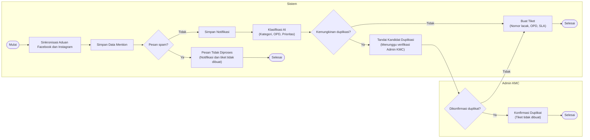
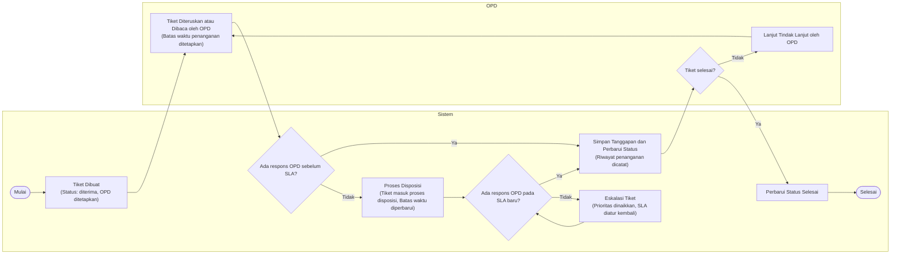
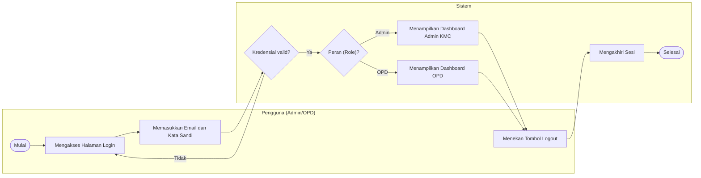
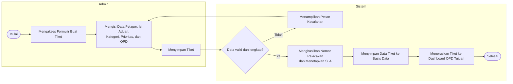
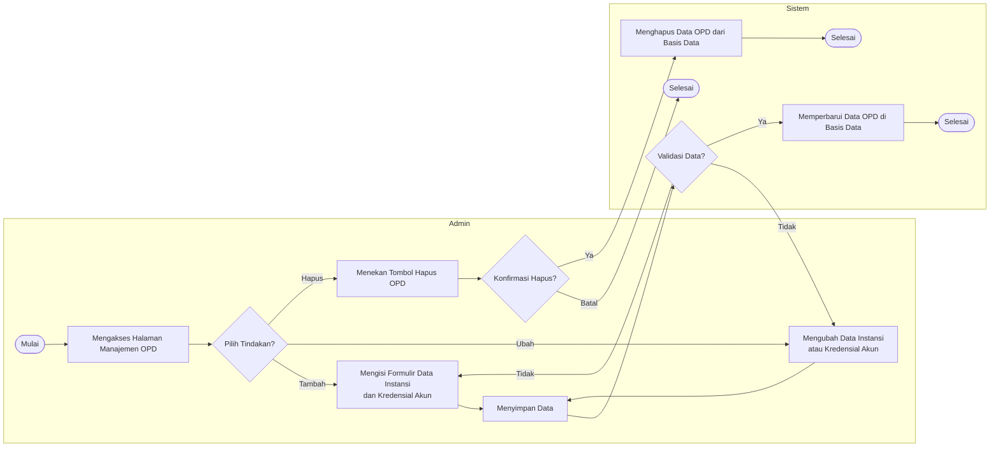
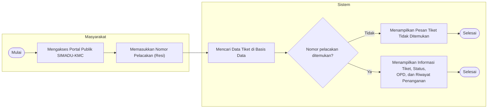

# Kode Mermaid.js Activity Diagram — Swimlane per Aktor (v2)

Berikut adalah kode Mermaid.js untuk keenam Activity Diagram, dihasilkan sesuai spesifikasi pada `Prompt_activity_revisi_v2.md`. Setiap diagram menggunakan `flowchart LR` sebagai root, dengan `subgraph` per aktor (`direction TB` di dalamnya) untuk mensimulasikan swimlane.

---

## 1. Activity Diagram Pengolahan Aduan dari Media Sosial
**Aktor:** Sistem, Admin KMC

---

## 2. Activity Diagram Tindak Lanjut Tiket dan Eskalasi SLA
**Aktor:** OPD, Sistem

---

## 3. Activity Diagram Login dan Logout
**Aktor:** Pengguna (Admin/OPD), Sistem

---

## 4. Activity Diagram Pembuatan Tiket Manual
**Aktor:** Admin, Sistem

---

## 5. Activity Diagram Manajemen Data dan Akun OPD
**Aktor:** Admin, Sistem

---

## 6. Activity Diagram Pelacakan Tiket oleh Masyarakat
**Aktor:** Masyarakat, Sistem

---

**Catatan implementasi:**
- Semua node keputusan (`{...}`) dan proses (`[...]`) dibungkus tanda kutip ganda agar tanda kurung, koma, dan tanda tanya di dalam label tidak memicu galat sintaks Mermaid.
- Pada Diagram 5, karena Mermaid tidak dapat mengarahkan panah balik secara kondisional ke jalur asal (Tambah/Ubah), panah "Tidak" dari `Validasi Data?` digambar rangkap menuju kedua node formulir (`Mengisi Formulir...` dan `Mengubah Data...`).
- ID subgraph diberi akhiran angka (mis. `Sistem1`, `Sistem2`) hanya agar tidak bentrok bila beberapa diagram digabung ke satu file `.mmd`; bila tiap diagram dirender terpisah, akhiran ini boleh dihapus.
