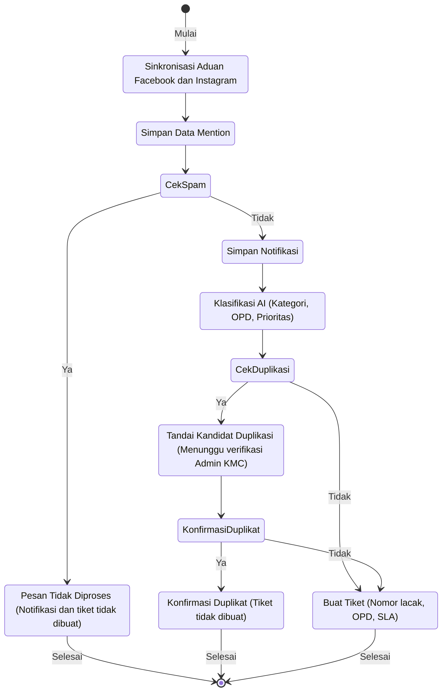
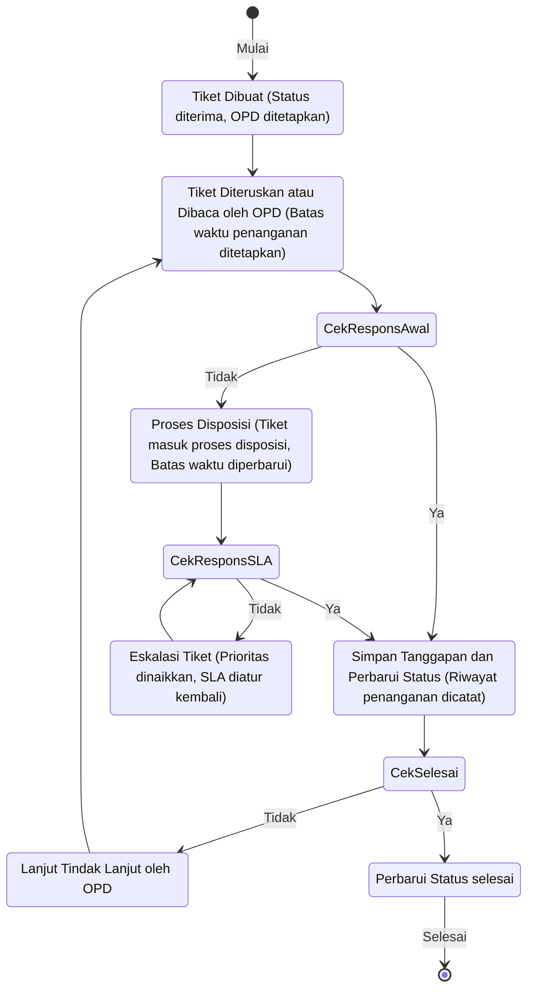
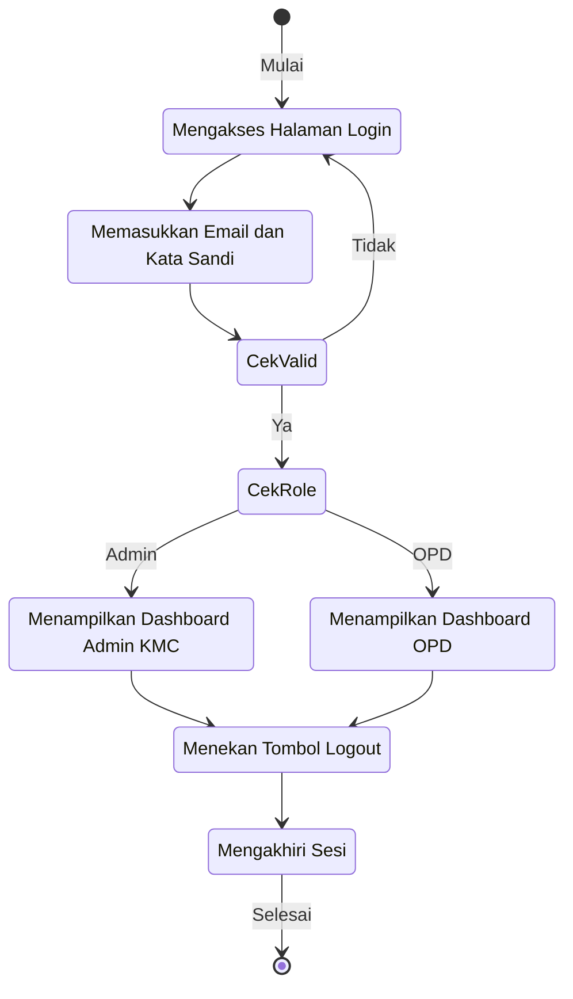
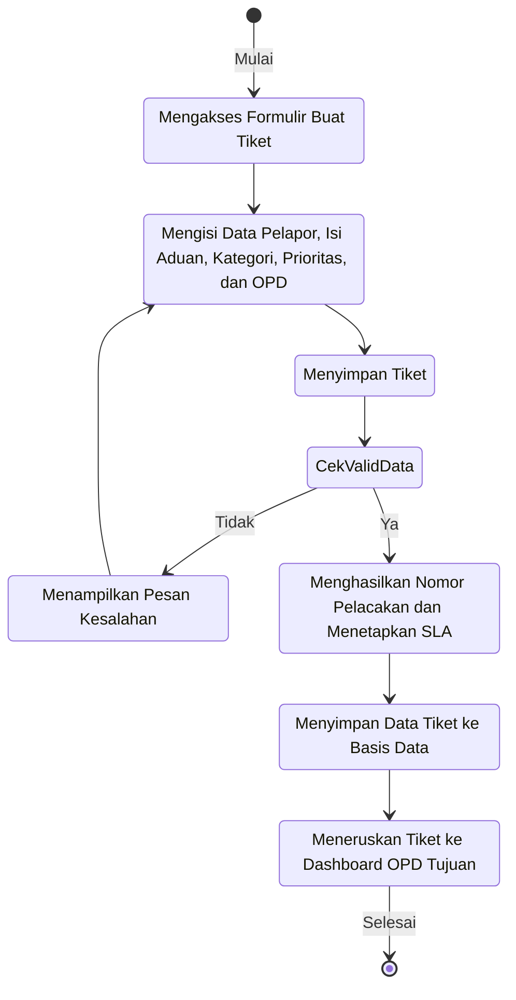
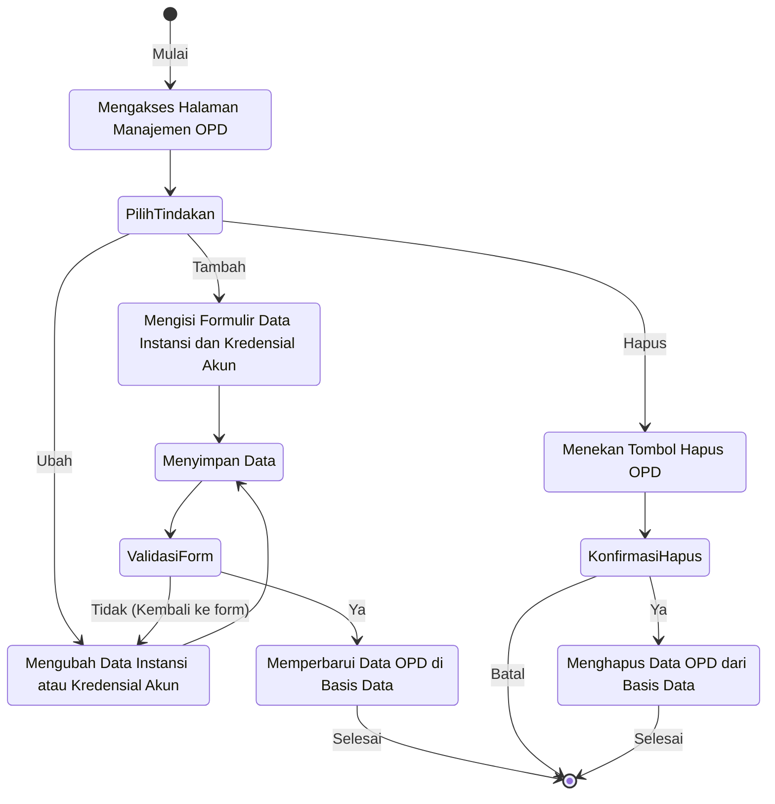
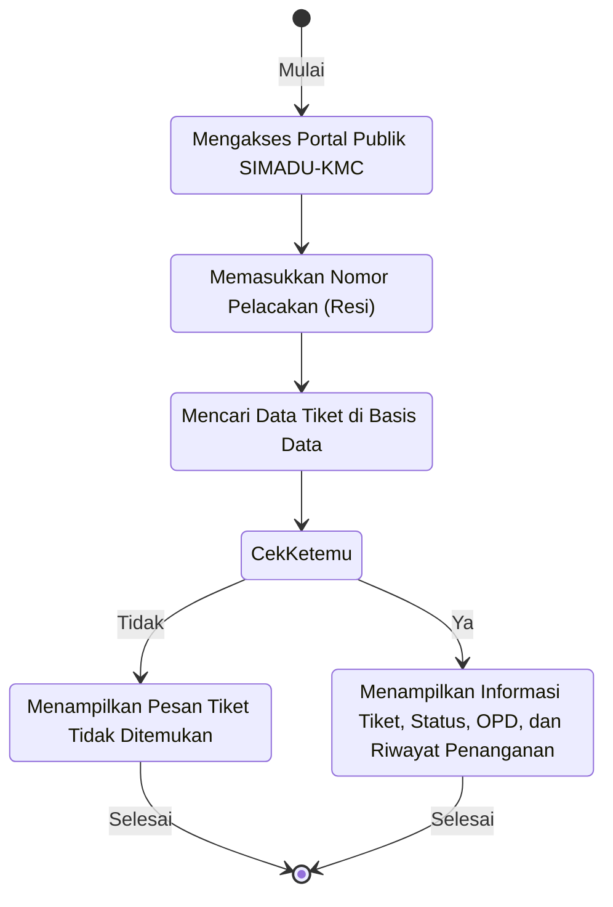

# Kode Mermaid.js untuk 6 Activity Diagram SIMADU-KMC

Gunakan kode-kode di bawah ini pada [Mermaid Live Editor](https://mermaid.live) atau plugin Markdown Anda untuk menghasilkan visualisasi yang siap digunakan.

---

### 1. Activity Diagram Pengolahan Aduan dari Media Sosial

---

### 2. Activity Diagram Tindak Lanjut Tiket dan Eskalasi SLA

---

### 3. Activity Diagram Login dan Logout

---

### 4. Activity Diagram Pembuatan Tiket Manual

---

### 5. Activity Diagram Manajemen Data dan Akun OPD

---

### 6. Activity Diagram Pelacakan Tiket oleh Masyarakat

