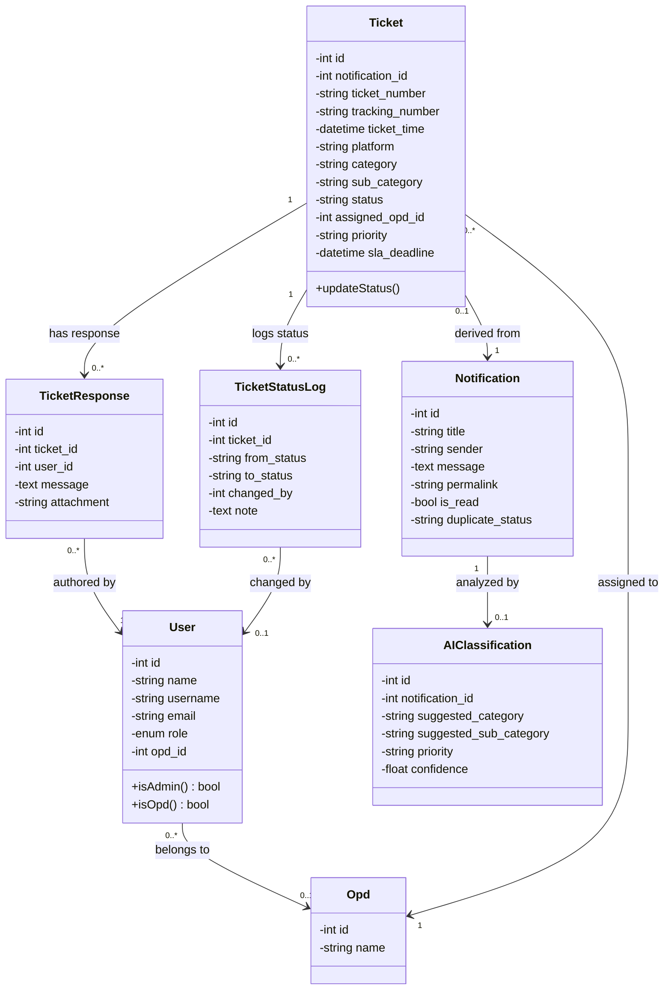

# Kode Mermaid.js untuk Class Diagram SIMADU-KMC

Gunakan kode di bawah ini pada [Mermaid Live Editor](https://mermaid.live) atau plugin Markdown Anda untuk memvisualisasikan Class Diagram Sistem secara cepat.

