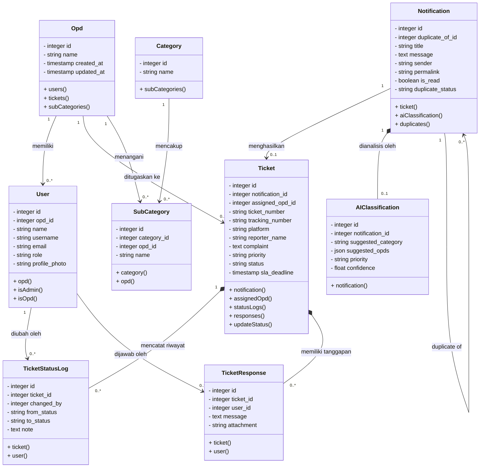

# Kode Mermaid.js untuk Class Diagram SIMADU-KMC

Gunakan kode di bawah ini pada [Mermaid Live Editor](https://mermaid.live) atau plugin Markdown Anda untuk menghasilkan visualisasi **Class Diagram** yang akurat, dengan semua relasi yang terhubung dengan benar.

---

### Perbaikan dalam Kode Mermaid Ini:
1. **Semua Hubungan Lengkap:** Saya sudah menghubungkan kelas `User` ke `TicketStatusLog` dan `TicketResponse` (karena log dan tanggapan dicatat oleh pengguna tertentu).
2. **Relasi Diri Sendiri (Self-Referencing):** Saya menambahkan relasi `Notification` ke `Notification` sendiri untuk menampung fungsi duplikasi aduan (`duplicate_of_id`).
3. **Simbol UML Standar PBO:** 
   *   `-` (Private) untuk semua kolom/atribut database.
   *   `+` (Public) untuk semua metode/fungsi.
   *   `*--` untuk *Composition* (Misal: Riwayat Log dan Tanggapan mutlak bergantung pada Tiket; jika Tiket dihapus, Log-nya juga dihapus).
   *   `-->` untuk *Association* biasa.
