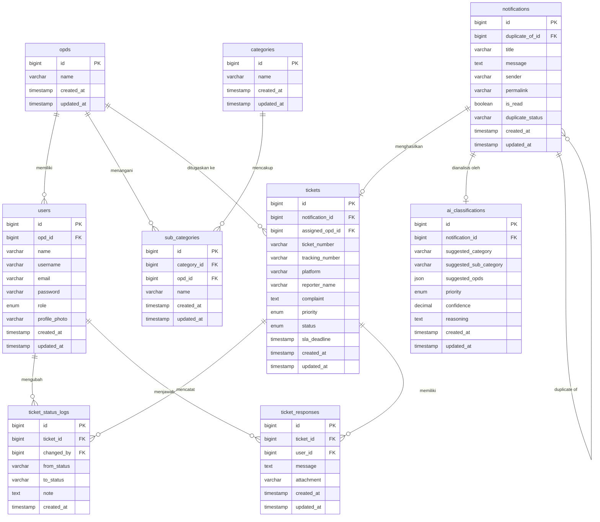

# Kode Mermaid.js untuk Entity Relationship Diagram (ERD) SIMADU-KMC

Gunakan kode di bawah ini pada [Mermaid Live Editor](https://mermaid.live) atau plugin Markdown yang mendukung Mermaid.js untuk menghasilkan visualisasi **ERD** dengan notasi Crow's Foot.

---

### Penjelasan Notasi Relasi (Crow's Foot):
*   `||--o{` : Relasi **Satu-ke-Banyak** *(One-to-Many)*. Contoh: Satu OPD (`||`) memiliki banyak Users (`o{`).
*   `||--o|` : Relasi **Satu-ke-Nol/Satu** *(One-to-Zero or One)*. Contoh: Satu Notifikasi (`||`) menghasilkan paling banyak satu Tiket (`o|`).

Kode ini sudah mencakup setiap atribut dengan tipe datanya, serta penanda **PK (Primary Key)** dan **FK (Foreign Key)** yang akurat sesuai migrasi basis data sistem Anda.
