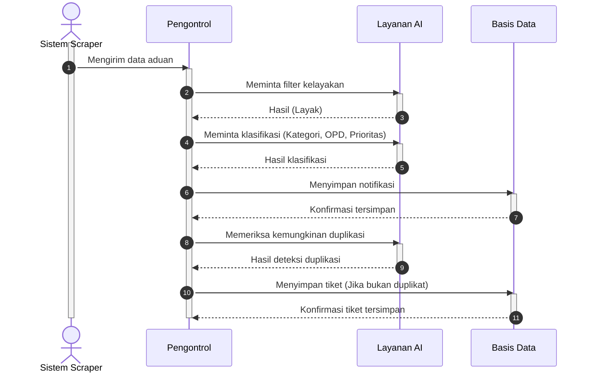
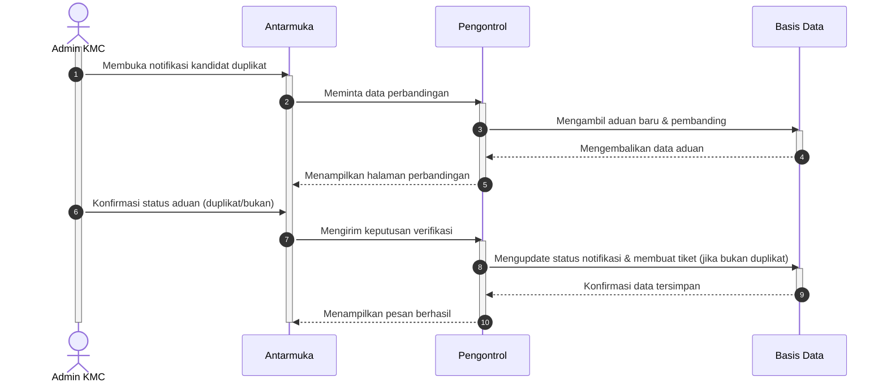
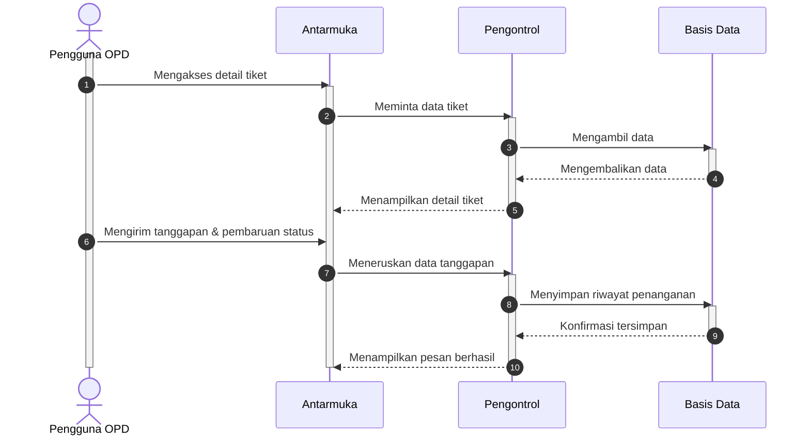
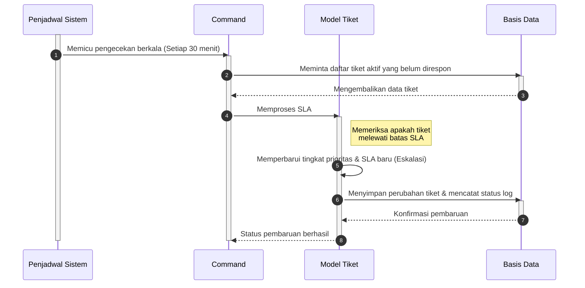

# Kode Mermaid.js untuk 4 Sequence Diagram Inti Sistem SIMADU-KMC

Gunakan kode-kode di bawah ini pada [Mermaid Live Editor](https://mermaid.live) atau plugin Markdown Anda untuk menghasilkan visualisasi yang siap digunakan. Desain ini mengikuti struktur diagram urutan (Sequence) dengan garis waktu *lifeline*.

---

### 1. Sequence Diagram Pengolahan Aduan (Sumber Otomatis Media Sosial)

---

### 2. Sequence Diagram Verifikasi Duplikasi oleh Admin KMC

---

### 3. Sequence Diagram Tindak Lanjut Tiket oleh Pengguna OPD

---

### 4. Sequence Diagram Eskalasi Prioritas Otomatis

